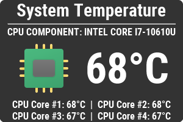

<h1 align="center">
  
</h1>

## About

<h4 align="center">

  

</h4>

TemperatureTray is a simple Java Swing application that shows current temperature in your city and system temperature in the system tray area

## Screenshots

### Weather

### System Temperature

##Libraries used

- [JSON-java](https://github.com/stleary/JSON-java)
- [jSensors](https://github.com/profesorfalken/jSensors)

